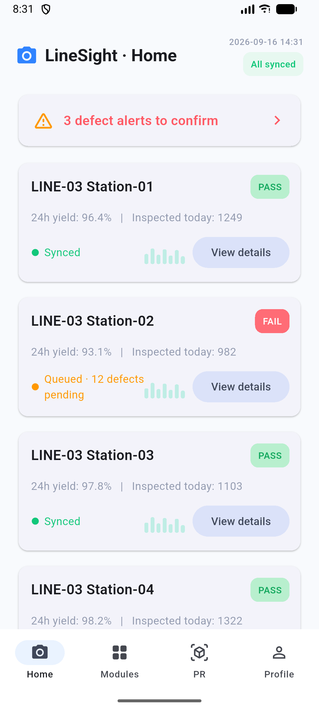

# LineSight

Flutter mobile prototype for LineSight, a production-line inspection HMI. The app currently has Home, Modules, PR inspection history, and Profile & Settings screens.



## Contributors

- [chaoyang](https://github.com/ChaoYANG)
- [KrOik](https://github.com/KrOik)

## Project progress — Week 4

| Workstream | Status | Deliverable / evidence |
|---|---|---|
| Flutter UI prototype | Done | Four interactive screens running on Android 16 (API 36) emulator; [source](lib/main.dart), [emulator screenshot](screenshots/android-home.png) |
| Screen redraws | Done | Four editable SVGs in [`design/svg-redraw`](design/svg-redraw/) |
| Week 4 stack research | In progress | [Tech stack deliverable](deliverables/week4/LineSight_Week4_TechStack.pdf); formal team decision and rationale still need to be recorded in the tracker |
| Mentor prototype walkthrough and feedback | Not started | Demo notes, mentor feedback, and three agreed changes |
| Draft 1 evidence trail | Not started | Notes, sketches, Visily, Figma, and Pixso artefacts, labelled to show which stages were used |
| Individual tool practice and learning log | Not started | Per-person Softr practice/certification progress and dated learning notes |
| Kanban and ownership | Not started | Cards with named owner, next action, and status |

Use the [weekly progress tracker](docs/PROJECT_PROGRESS.md) to update evidence, the 3/2/2 working groups, stack decisions, and individual contributions. Planned work remains marked as not started until evidence is added.

## Run on Android

Requirements: Flutter 3.27 or newer and Android SDK. The Android runner is included.

```sh
flutter pub get
flutter emulators
flutter run -d <device-id>
```

The app has no runtime package dependencies. Its current data is sample content for the prototype.

## Repository layout

```text
lib/main.dart                         Flutter app and screens
design/svg-redraw/                    Editable SVG screen redraws
screenshots/android-home.png          Emulator screenshot
deliverables/week4/                   Week 4 technology-stack report
docs/PROJECT_PROGRESS.md              Weekly work and contribution tracker
```
